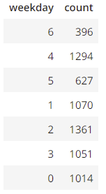

# Introduction
In this project I am working for a fictional company named Sparkify. The company has songs and user activity from their music streaming app, stored in a directory of JSON logs for user activity on the app, as well as a directory with JSON metadata on the songs on the app. 

Their analytics team would like me to create a Postgres database with tables designed to optimize queries on song play analysis. My goals are to create a database schema, a ETL pipeline for analysis, and match my test results with the teams expected results.

## Schema
Since the analysts would like simple queries, and our data may have mutiple copies of the same song data, a Star Schema is perfect for the job since it allows for denormalized data modeling, fast aggregations, and works with simplified user queries. This Star Schema consists of songplays as our one fact table, and time, users, songs, and artists as our dimension tables. 

  

## ETL pipeline
Extract, transform, load processes in etl.py populate the songs and artists tables with the datafrom the JSON song files, data/song_data. Processed data is from the JSON log files, data/log_data and is used to populate time and users tables.

### Data in this project
Data is collected for song and user activities, in two directories: data/log_data and data/song_data

### The song data set.

**Song Data Set Example**

    {"num_songs": 1,
    "artist_id": "ARJIE2Y1187B994AB7",
    "artist_latitude": null, "artist_longitude": null,
    "artist_location": "", 
    "artist_name": "Line Renaud",
    "song_id": "SOUPIRU12A6D4FA1E1",
    "title": "Der Kleine Dompfaff", 
    "duration": 152.92036, "year": 0}

### The Log Dataset.
**Log Data Set Example**

    {
      "artist": "Survivor",
      "auth": "Logged In",
      "firstName": "Jayden",
      "gender": "M",
      "itemInSession": 0,
      "lastName": "Fox",
      "length": 245.36771,
      "level": "free",
      "location": "New Orleans-Metairie, LA",
      "method": "PUT",
      "page": "NextSong",
      "registration": 1541033612796,
      "sessionId": 100,
      "song": "Eye Of The Tiger",
      "status": 200,
      "ts": 1541110994796,
      "userAgent": "\"Mozilla/5.0 (Windows NT 6.3; WOW64) AppleWebKit/537.36 (KHTML, like Gecko) Chrome/36.0.1985.143 Safari/537.36\"",
      "userId": "101"
    }

## Project Repository files

>### Sql_queries
>Contains Drop, Create, Insert and Select sql queries for easy database access.

        
>### Create_tables.py
Imports from sql_queries  create_table_queries, drop_table_queries
    
    
>### test.ipynb
>Contains test sql queries for table and data quality load testing.
    
    
>###elt.ipynb
>Contains the tests for setting up the ETL processes to take the data from the song data and the log data to create the artists, users, time tables, >and the fact table songplays.
    
    
 >### etl.py 
 >After planning out the processes and testing them in elt.ipynb, here is where I put the processes into action and load the data. 
        
       
 

## Example Queries
*Also see these in action in text.ipynb* 

    SELECT COUNT(level) FROM users WHERE level = 'free';
result is the count 74, for how many user have the free membership level
    
    SELECT COUNT(level) FROM users WHERE level = 'paid';
result is the count 22, for how many user have the paid membership level
    
    sql SELECT weekday, COUNT(weekday) FROM time GROUP BY weekday;
result is a table with the number of plays for each day.
  
  
    
    
## How to run this project

### To run the project locally
#### In the terminal
>python create_tables.py
>python etl.py

#### In Ipython
>run create_tables.py
>run etl.py

    
    
    
    
    
